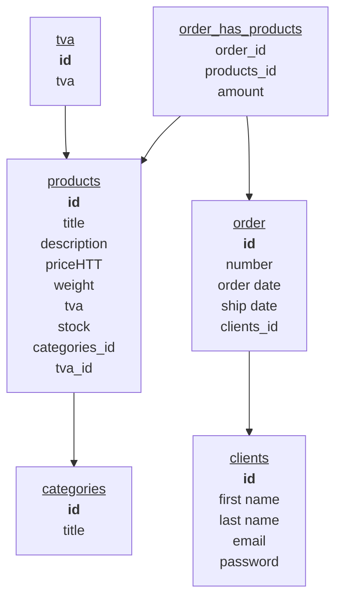
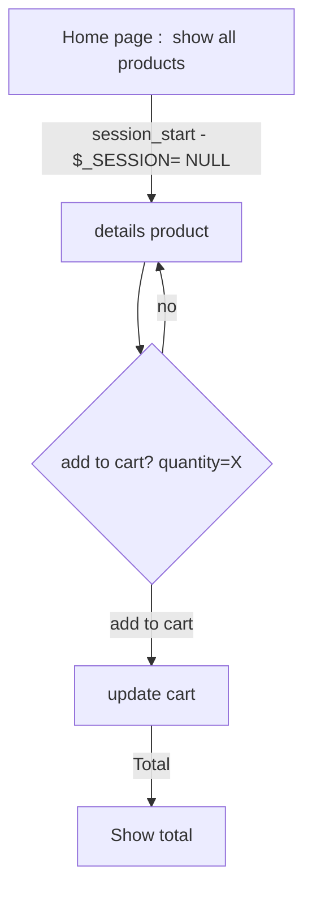

```mermaid
flowchart TD
    products[<u>products</u>
    <b>id</b>
    title
    description
    priceHTT
    weight
    tva
    stock
    categories_id
tva_id]-->categories[<u>categories</u>
    <b>id</b>
    title
    ]
    order-->clients[<u>clients</u>
    <b>id</b>
    first name
    last name
    email
    password]
    order_has_products-->products
    order_has_products-->order
    order[<u>order</u>
    <b>id</b>
    number
    order date
    ship date
    clients_id]
    order_has_products[<u>order_has_products</u>
    order_id
    products_id
    amount
    ]
    tva-->products
tva[<u>tva</u>
<b>id</b>
tva]
```

```mermaid
flowchart TD
A[Home page :  show all products ] -->|session_start - $_SESSION= NULL| B(details product)
B --> C{add to cart? quantity=X}
C -->|add to cart | D[update cart]
C -->|no| B[details product]
D --> |Total | E[Show total]
```